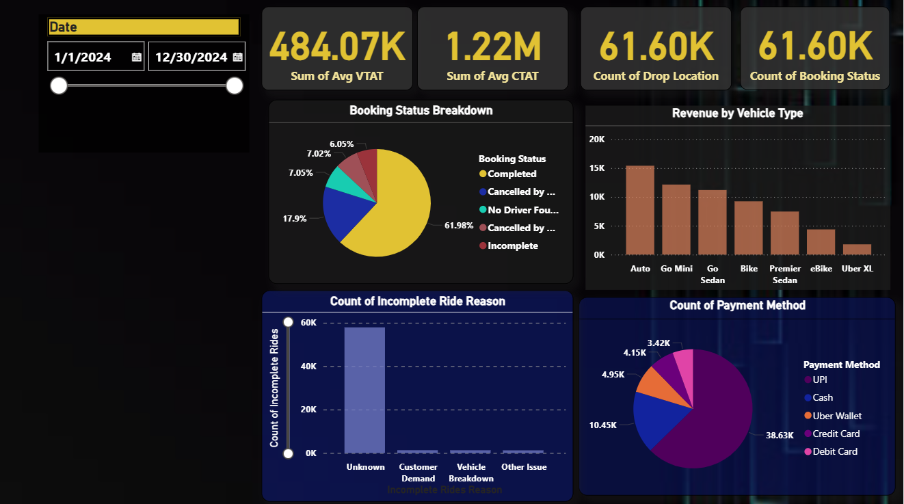

# Uber-Data-Analysis-Dashboard-Power-BI-
This project analyzes Uber ride data using Power BI to uncover key trends and patterns in customer behavior and ride demand. The goal is to provide data-driven insights for better decision-making.

# 🚖 Uber Data Analysis Dashboard (Power BI)

## 📌 Project Overview
This project analyzes Uber ride data using **Power BI** to uncover key trends and patterns in customer behavior and ride demand.  
The goal is to provide **data-driven insights** for better decision-making.

Data Cleaning & Preprocessing

Removed duplicate records and standardized date-time formats.

Handled missing values by replacing unknowns with "Unknown" or appropriate defaults.

Converted categorical fields (e.g., Vehicle Type, Payment Method) into clean, consistent labels.

Ensured numerical fields (e.g., Booking Value, Ride Distance, Ratings) were correctly typed.

Final dataset: 61,601 rows × 21 columns ready for analysis in Power BI.

📑 Dataset Fields

The dataset contains the following 21 fields:

Date – Date of the ride booking

Time – Time of the ride booking

Booking ID – Unique ride booking identifier

Booking Status – Completed / Incomplete / No Driver Found, etc.

Customer ID – Unique customer identifier

Vehicle Type – Type of vehicle (Bike, Auto, Sedan, etc.)

Pickup Location – Ride starting location

Drop Location – Ride ending location

Avg VTAT – Average Virtual Turnaround Time

Avg CTAT – Average Completion Turnaround Time

Cancelled Rides by Customer – Count of customer cancellations

Reason for cancelling by Customer – Recorded reason for cancellation

Cancelled Rides by Driver – Count of driver cancellations

Driver Cancellation Reason – Recorded reason for driver cancellation

Incomplete Rides – Count of incomplete rides

Incomplete Rides Reason – Reason for ride incompletion

Booking Value – Ride fare value

Ride Distance – Distance of the ride (in km)

Driver Ratings – Rating given to the driver

Customer Rating – Rating given by the customer

Payment Method – Mode of payment (UPI, Card, Cash, etc.)

## 📊 Key Features
- Interactive **Power BI Dashboard** (`Uber_Data_Analysis_Dashboard.pbix`)
- Cleaned dataset (`Cleaned_Uber_Data.csv`) prepared for analysis
- Insights on:
  - Ride distribution by date & time
  - Top customers and ride frequency
  - Demand patterns & trip analysis

## 🛠 Tools & Skills
- **Power BI** – Data modeling & visualization
- **Data Cleaning** – Handling missing values & formatting data
- **Exploratory Data Analysis (EDA)** – Identifying trends & insights

## 📂 Repository Contents
- `Cleaned_Uber_Data.csv` → Processed dataset used for analysis  
- `Uber_Data_Analysis_Dashboard.pbix` → Power BI dashboard file  
- `Screenshots/` → Sample images of dashboard visuals  
- `README.md` → Project documentation

## 📸 Dashboard Preview

---

✨ Feel free to fork or star this repo if you found it useful!  

ismai addon kro kaise i cleaned or preprocess my data 
and what all fields are there in the dataset
